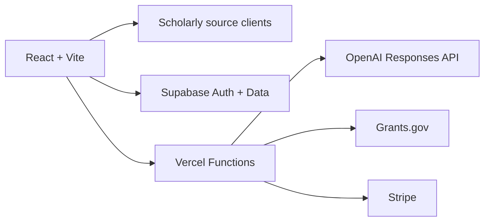

# EYLO

EYLO is a research workspace that helps a user turn a question into a source-backed next step.

It combines live scholarly discovery, AI-assisted reasoning, researchers, funding records and project execution while keeping evidence, inference and uncertainty distinguishable.

**Live product:** [eyloai.vercel.app](https://eyloai.vercel.app/)

## Core experience

A useful EYLO journey is deliberately narrow:

1. Enter a research topic.
2. State your level, goal and recency preference.
3. Retrieve and deduplicate records from connected scholarly indexes.
4. Separate recent, foundational and entry-point literature.
5. Save relevant evidence, researchers and opportunities to a private workspace.
6. Use EYRA to reason over that context and define the next research action.

Public evidence discovery is available before account creation. Saving work, project context, funding search and EYRA actions require authentication.

## Current capabilities

### Public

- Guided discovery tuned to the user's level, goal and recency preference
- Scholarly metadata from OpenAlex, arXiv, Europe PMC, Crossref and Semantic Scholar
- Deduplication and grouping into entry-point, recent, foundational and additional records
- Researcher and institution discovery through OpenAlex
- Direct links back to source records

### Authenticated workspace

- Supabase authentication and user-scoped saved data
- Evidence, researcher and opportunity collections
- Projects, milestones, ideas and research history
- EYRA analysis through the OpenAI Responses API
- Project-aware research, team, impact and planning workflows
- Official US funding records from Grants.gov
- Stripe Checkout, webhook and entitlement foundations

## Trust model

EYLO is designed to support research judgment, not replace it.

- Retrieved records are source-backed inputs, not automatic scientific truth.
- Model inference is not presented as verified evidence.
- Citation counts provide context and are not treated as quality scores.
- Funding eligibility, deadlines and programme terms must be checked at the official source.
- AI output must be reviewed before it informs scientific, funding or project decisions.
- Saved workspace records are scoped to the authenticated user.

## Architecture



| Layer | Implementation |
|---|---|
| Client | React 18, Vite, React Router, TanStack Query, Tailwind CSS |
| Identity and persistence | Supabase Auth, Postgres and row-level security |
| AI | Server-side OpenAI Responses API with structured-output support |
| Research retrieval | OpenAlex, arXiv, Europe PMC, Crossref and Semantic Scholar |
| Funding retrieval | Authenticated Vercel Function backed by Grants.gov |
| Billing | Stripe-hosted Checkout, webhook verification and server-controlled entitlements |
| Hosting | Vercel deployments and serverless functions |

## Local setup

Requirements:

- Node.js 24
- npm
- A Supabase project for authenticated features

```bash
git clone https://github.com/panagiotagrosdouli/eyloai.git
cd eyloai
cp .env.example .env.local
npm install
npm run dev
```

The public client needs:

```env
VITE_SUPABASE_URL=
VITE_SUPABASE_ANON_KEY=
```

AI, funding verification, billing and monitoring also require server-only values. See [`.env.example`](.env.example). Never expose secret or service-role keys through `VITE_*` variables.

## Validation

```bash
npm run check:imports
npm run typecheck
npm run lint
npm run build
```

GitHub Actions and Vercel preview deployments run the production build for proposed changes.

## Known limitations

- Discovery is a relevance aid, not a systematic-review protocol.
- Search quality depends on source metadata, abstracts and upstream availability.
- EYRA can reason over retrieved context, but its synthesis still requires human verification.
- Funding coverage currently uses Grants.gov and is not global.
- Billing remains in early-access mode until every required Stripe and server-side Supabase credential is configured.
- Scheduled monitoring and institution analytics require their server-side configuration.
- No claim is made about publications, institutional partnerships, benchmark performance or production adoption.

## Near-term roadmap

1. Evaluate discovery relevance on a small, documented set of research tasks.
2. Make saved evidence trails shareable with explicit public/private controls.
3. Improve recovery states for source timeouts and partial retrieval.
4. Complete production billing and entitlement verification.
5. Add privacy-conscious activation and retention measurement.

## Contributing

Keep changes focused on user value, evidence integrity and maintainability.

Before opening a pull request:

- explain the user problem,
- avoid unsupported product claims,
- include loading, empty and error states,
- verify keyboard and mobile behavior,
- run the validation commands above.
